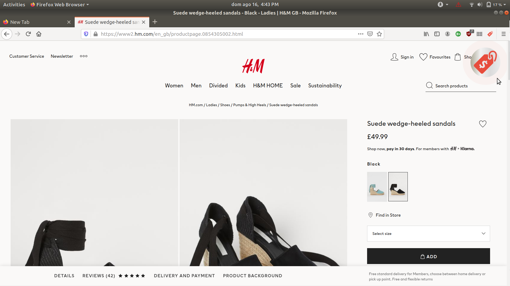
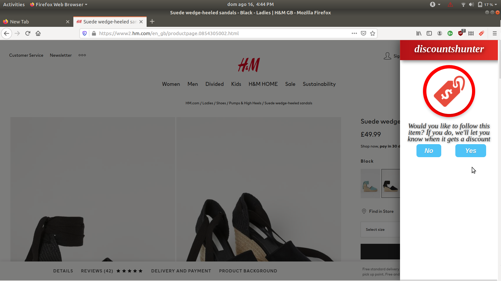
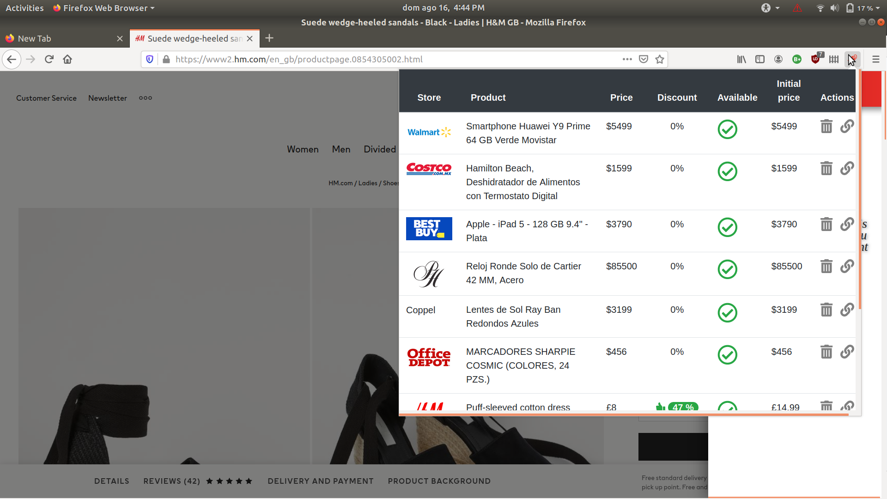

# cazadescuentos
This is the open source version for the [cazadescuentos](https://cazadescuentos.net) app.

The [chrome](chrome) project is the browser extension which you can find on the following stores:
- [Firefox](https://addons.mozilla.org/es/firefox/addon/cazadescuentos/)
- [Chrome](https://chrome.google.com/webstore/detail/discountshunter/miadcmhlfknbjhlknpaidjnelinghpdf)

The [landing-page](landing-page) project is our main [website](https://cazadescuentos.net).

The [pwa](pwa) project is the Progressive Web App that's used as a Trusted Web Activity on [Android](https://play.google.com/store/apps/details?id=net.cazadescuentos.app).

The [android](android) project is the Trusted Web Activity wrapping the [pwa](pwa) project.

## Why?
The purpose for this app is to let you save money, by solving these problems:
- You are willing to buy an item, but you don't feel like paying the current price, you start tracking the item with the browser extension, which will notify you when the item gets a discount.
- You just bought an item, paying with a credit card offering the price protection insurance, you start tracking the item, and get notified when it's price drops, so that you get a reimbursement.

## How?
Just go to your favorite online store, choose the item you are interested in, and click on the price tag icon to start following such item:

You will be required to confirm your intention to track the item:

When you click on the extension icon that's on the browser tool bar, you will get a summary on your tracked items:

When you are on Firefox for Android, you should see this instead:

## Supported stores
World-wide:
- [H&M](https://www2.hm.com/)
- [H&M mobile](https://m2.hm.com/m/)
- [Zara](https://www.zara.com/)
- [ebay](https://www.ebay.com)

Mexico:
- [Liverpool](https://www.liverpool.com.mx)
- [Coppel](https://www.coppel.com)
- [Office Deport](https://www.officedepot.com.mx)
- [Sanborns](https://www.sanborns.com.mx)
- [Sams](https://www.sams.com.mx)
- [Mercado Libre](https://www.mercadolibre.com.mx)
- [Elektra](https://www.elektra.com.mx)
- [Costco](https://www.costco.com.mx)
- [Home Depot](https://www.homedepot.com.mx)
- [Walmart](https://www.walmart.com.mx)
- [Best Buy](https://www.bestbuy.com.mx)
- [Palacio de Hierro](https://www.elpalaciodehierro.com)
- [Amazon Mx](https://www.amazon.com.mx)

US:
- [Office Depot](https://www.officedepot.com)
- [Sams Club](https://www.samsclub.com)
- [Nordstrom](https://shop.nordstrom.com)
- [Best Buy](https://www.bestbuy.com)

## Privacy
We value the user privacy, just install the extension from the official stores (or directly from the source code), generally:
- We don't need you provide any personal information, which is why the alerts get directly on your browser (no email/phone number required).
- The extension only uses the permissions that are strictly necessary.
